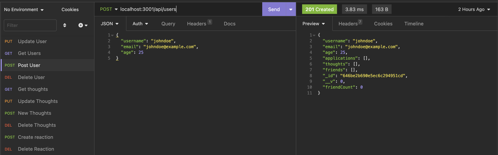

# socialnetwork

| Technology Used         | Resource URL           | 
| ------------- |:-------------:| 
| Git | [https://git-scm.com/](https://git-scm.com/)     |    
| JavaScript | [https://developer.mozilla.org/en-US/docs/Web/JavaScript](https://developer.mozilla.org/en-US/docs/Web/JavaScript)     
| Node.JS| [https://developer.mozilla.org/en-US/docs/Glossary/Node.js?utm_source=wordpress%20blog&utm_medium=content%20link&utm_campaign=promote%20mdn](https://developer.mozilla.org/en-US/docs/Web/API/Fetch_API)    
| MongoDB |:https://www.mongodb.com/:| 
| Mongoose|:https://mongoosejs.com/docs/:| 


## Description 



Video of the application in action: https://drive.google.com/file/d/1KuBuWjxpKzC7Q8e6FFLFjotGjmJf4FYR/view

This is a social media backend which has a collection of users, their thoughts and reactions to those thoughts.  


## Code Refactor Example


Below is a model table for mongodb for User creation

```Javascript


cconst thoughtSchema = new Schema(
  {
    thoughtText: {
      type: String,
      required: true,
      minlength: 1,
      maxlength: 280,
    },
    createdAt: {
      type: Date,
      default: Date.now,
    },
    username: {
      type: String,
      required: true,
    },
    reactions: [reactionSchema],
  },
  {
    toJSON: {
      getters: true,
    },
    id: false,
  }
);
```

Below is a route for creating a new reactioon

``` JavaScript

router.post('/:thoughtId/reactions', async (req, res) => {
  try {
    const { thoughtId } = req.params;
    const thought = await Thought.findOneAndUpdate(
        {_id: thoughtId},
        {$addToSet: {reactions:req.body}},
        {new: true}
    );
    if (!thought) {
      return res.status(404).json({ error: 'Thought not found' });
    }
    res.status(201).json(thought);
  } catch (err) {
    res.status(400).json({ error: 'Failed to create reaction' });
  }
});

``` 


## Usage 

You will need to clone down all the repro.  Install the needed NPM packages. Then you will be able to execute the program by running "npm start server"


## Learning Points 


This was all about learning how to use MongoDB and I got to say I think its a bit easier and less cumbersome than MySQL.  I don't find relational databases all that intuitive but i love how straight forward this stuff is.   

## Author Info

SWEngineer looking to learn as much as I can, hope to one day solo create an amazing videogame. 

* [Portfolio](https://bdalberson.github.io/Course2Biopage/)
* [LinkedIn](https://www.linkedin.com/in/brian-alberson-464b2271/)
* [Github](https://github.com/bdalberson)
```

## Credits

TAs like Kyle helped a lot, study groups, and of course my family giving me time and space and work on this code money stuff. 

---

## Tests
Just testing using MongoDB Compass to verify datatables and Insomnia to verify route data.   

